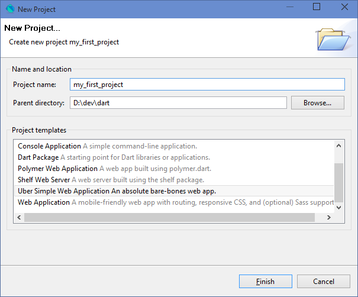
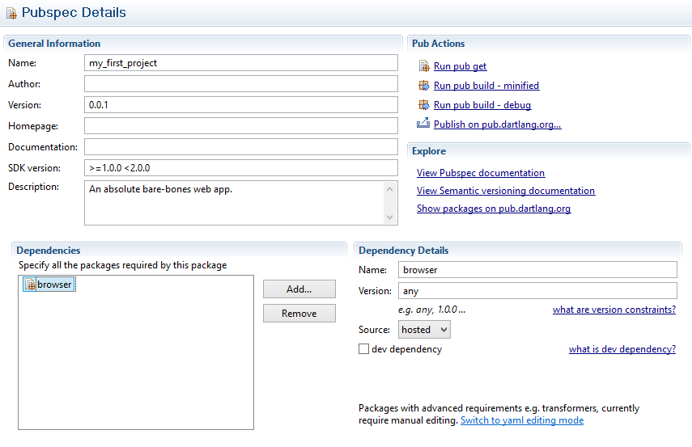
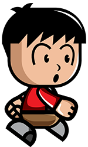
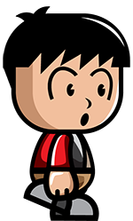
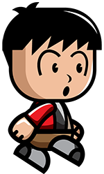
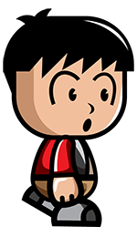
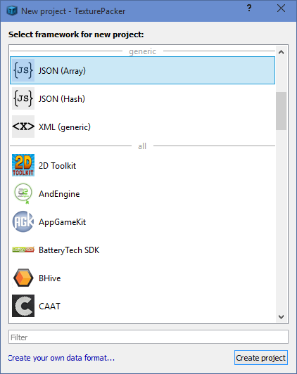

## Getting started with StageXL and Texture Packer ##

<iframe src="http://www.stagexl.org/example/basic/texture_atlas" width="960" height="400" frameborder="1">
</iframe>
 
Get the source for this side scrolling demo [here](https://github.com/bp74/StageXL_Samples/tree/master/example/basic/texture_atlas).

## What is StageXL and why should i care? ##

StageXL is a 2D render framework for the Dart programming language. The project started in late 2012 with one goal: Providing an HTML5 framework for Flash developers that is familiar to use and does not require to write code in JavaScript. If you are used to work with ActionScript 3 you definitely don't want to write code in JavaScript.

Today, StageXL not only provides an API that is very similar to the Flash API (DisplayList, EventDispatchers, Sounds, Filters, Masks, etc.) but also adds many features to make it easier to work with HTML5 and the Web. One of those features in StageXL is the support for TexturePacker. In fact the default texture atlas format in StageXL is the JsonArray format of TexturePacker - you will learn more about this in a short while.

Even if StageXL started as an alternative to Flash, it is used by many developers who have no prior experience with Flash or ActionScript. The Dart language is fun to use, easy to learn , highly productive and should be considered by every developer who wants to write apps for the modern web.

## What is TexturePacker and why should i care? ##

TexturePacker is probably the most commonly used tool to work with graphical assets. A web application like a game often uses dozens or even hundreds of images. In practice it is not recommended to download many images one by one from a web server. Downloading many small images (especially on mobile devices) does increase the download time and bandwidth usage. Therefore you want to merge many small images into one big image that is downloaded with a single http request. This is what TexturePacker does for you!

Besides the optimized download there is another very important advantage in combining many small images into one big texture. Performance! The GPU in your PC, Mac or mobile phone will draw pixels much faster to the screen if you combine all your small images on one big texture.  

TexturePacker provides two funny videos which tells you a lot about texture atlases (also known as sprite sheets, which is the term used in the videos). The first video shows how sprite sheets are used to reduce memory usage and the second video shows how sprite sheets help to increase performance of your application or game.

<iframe width="400" height="225" src="https://www.youtube.com/embed/crrFUYabm6E" frameborder="0" allowfullscreen></iframe>

<iframe width="400" height="225" src="https://www.youtube.com/embed/_KyUqyS5MLA" frameborder="0" allowfullscreen></iframe>

Of course the rendering is done by StageXL, but using a texture altas (or sprite sheet) will help StageXL to give you the best performance possible. Using a texture atlas will improve the render performance in most use cases by a factor of 10 or even more.

## A simple web application with Dart and StageXL ##

The following guide will show you the necessary steps to write a simple web application in Dart. The application will load a texture atlas generated with TexturePacker and it will show the images from the texture atlas on the screen. This are the things we have to do to make everything work:
   
* How to download Dart Editor
* How to create a new project
* How to add StageXL to the project
* How to initialize StageXL
* How to create a texture atlas
* How to use a texture atlas in StageXL 
* How to proceed from here on

### How to download Dart Editor ###

Dart Editor is the development environment provided by the Dart team. It is an editor, a debugger, does code analysis, provides refactoring, shows errors, warnings and hints and last but not least compiles Dart code to JavaScript. This compiled JavaScript runs on all modern browsers. 

Please go to [www.dartlang.org](https://www.dartlang.org) and download the Dart Editor for your operating system. Dart Editor is available for Windows, Mac and Linux. After the download you just have to extract the zip file to your disk and start Dart Editor. The website also has lots of information and getting started guides for Dart. Even if Dart looks very familiar to most developers right away, it may be a good idea to check out some of the information available on the website.

### How to create a new project ###

Start Dart Editor and select File/New Project.

Since we don't want to build a complicated HTML5 application, please choose the "Uber Simple Web Application" template. If you are interested  in more advanced web development you may take a look at the other project templates later. Enter a project name and the directory where the project should be created.   

The "uber simple" project doesn't do much right out of the box. This is good because we don't get distracted by stuff we don't need. The "File" view in Dart Editor shows your project - please open the "web" folder and find the "index.html" file. Right click on "index.html" and select "Run in Dartium". A browser will open automatically and you will see your first Dart application - awesome!

What is Dartium? Dartium is a version of Chromium (which is the open source version of the Chrome browser) that has a built in virtual machine for Dart code. A normal browser has a virtual machine for JavaScript, but since we want to write Dart code a browser with the Dart VM come in handy. Unfortunately no other browser has a built in Dart VM right now, but this isn't much of an issue since Dart code compiles perfectly fine to JavaScript code and therefore runs in all browsers. In developer mode the Dart VM is very useful because you can run and debug your application without any intermediate compile steps. Just by pressing F5 in the browser the application restarts immediately.

### How to add StageXL to the project ###

Right now our application isn't doing much. The first step to build something useful is to add a dependency to StageXL. The Dart infrastructure provides a package manager called Pub. You can take a look at available packages (libraries) on the [Pub homepage](https://pub.dartlang.org/) but for our first application all we need is StageXL. To add StageXL to our project please double click the "pubspec.yaml" file in your project.

Don't get distracted by all those settings. Just click the "Add" button and enter "StageXL". You will see more than one search result - the reason is that there is a core StageXL package and also extension packages for StageXL. Just select the package called "stagexl" and click "OK". Now the dependency list contains two packages: browser and stagexl. Press CTRL+S or click the Save icon and the pubspec.yaml file will be saved. By saving this file the Pub package manager automatically downloads the newly added package - which is StageXL of course.

### How to initialize StageXL ###

The canvas HTML5 element is used to render arbitrary content on a web page. You don't need to know much about HTML5 and the canvas element, just open the "index.html" file in Dart Editor and change the body to look like this:  

    <body>
      <!-- 

 -->
      <canvas id="stage" width="800" height="600"></canvas>
      
      
    </body>

The script tags were previously added by the "Uber Simple Web Application" template. They are necessary to load and run the code of our application. You only have to add the line with the the canvas element and you should remove the line with the div element which was used by the "Uber Simple Web Application" template. The canvas element has a size of 800x600 pixels and StageXL will use this region to render its content.

Next we have to write a little bit of code to initialize StageXL. Please open the file "main.dart" and replace it's current content with the code below. This code initializes StageXL and shows a simple red square, just to see if everything works as intended.    
	
	import 'dart:html';
	import 'package:stagexl/stagexl.dart';
	
	void main() {
	
	  // init the stage and render loop, opt in for webGL
	  var canvas = querySelector('#stage');
	  var stage = new Stage(canvas, webGL: true, color: Color.LightGray);
	  var renderLoop = new RenderLoop();
	  renderLoop.addStage(stage);
	
	  // create a red square to see if everything works as intended
	  var bitmapData = new BitmapData(200, 200, true, Color.Red);
	  var bitmap = new Bitmap(bitmapData);
	  bitmap.x = 100;
	  bitmap.y = 100;
	  stage.addChild(bitmap);
	}

Right click on the "index.html" file and select "Run in Dartium". A browser windows should open and you should see the Stage (in light gray color) and the red square. Hurray! Those of you who have prior experience with Flash and ActionScript 3 will notice that the code for the BitmapData and Bitmap is pretty much identical to Flash.

### How to create a texture atlas ###

Before we continue with StageXL we have to create a texture atlas with TexturePacker. TexturePacker has many features we won't show in this tutorial. Check out the the documentation on the [TexturePacker homepage](https://www.codeandweb.com/texturepacker) to learn more about those features. TexturePacker is available as a free version for Windows, Mac and Linux. The free version provides all the features you will need to create a texture atlas, the full version is available for little money and provides more advanced features.

Okay let's get started! Below are 6 images for a sprite sheet animation of a running boy. You can right click on the images and download the files to your local disk. Sprite sheet animations are perfectly suited for a texture atlas. The images are small and you need quite a few of those images to get a nice looking animation. Of course a texture atlas is also very useful for sprites which are not part of an animation.

 
Special thanks to [bevouliin.com](http://bevouliin.com/) for the animation. CC0 1.0 Universal - Public Domain Dedication

Please download and install [TexturePacker](https://www.codeandweb.com/texturepacker). Right after the start you have to select the framework you are using. If you can't find the StageXL framework, please select the generic JSON (Array) export format. The StageXL format is identical to the JSON (Array) format, but TexturePacker specializes the available settings for StageXL if StageXL is selected. StageXL also supports other formats like the one of LibGDX, but JSON (Array) is recommended and also the default.   

Next, simply drag and drop the images to TexturePacker. Be sure to enter the correct file names for the JSON and PNG output file. The JSON file will contain the definitions where each image is located on the texture atlas, the PNG file will contain the texture atlas image. Save the project for later adjustments and press the "Publish sprite sheet" button to finally export the texture altas files.

Please take a look at the JSON and PNG file exported by TexturePacker. The JSON file contains the location and size for each image. StageXL uses this information to access the images in the texture atlas and make them available to the developer as if the images are still separated. It's worth mentioning that the texture atlas in our example only contains a few images and is very simple. Your game may contain many more images with different sizes, all merged into one texture atlas. If the texture atlas image gets too big, it's reasonable to create more than one texture atlas. Put those images together which are rendered/visible at the same time. The GPU can only work with one texture atlas at a time and switching between textures is slow (as explained in the second video above).

### How to use a texture atlas in StageXL ###

Last but not least we have to load the texture atlas and use it to draw content to the screen. You can open the "main.dart" file of the Dart project we have created earlier and replace the old code with this new code:

	import 'dart:html';
	import 'package:stagexl/stagexl.dart';
	
	void main() {
	
	  // init the stage and render loop, opt in for webGL
	  var canvas = querySelector('#stage');
	  var stage = new Stage(canvas, webGL: true, color: Color.LightGray);
	  var renderLoop = new RenderLoop();
	  renderLoop.addStage(stage);
	
	  // use the ResourceManager to load resources from the server
	  var resourceManager = new ResourceManager();
	  resourceManager.addTextureAtlas("atlas", "images/boy_atlas.json");
	
	  // loading resources is an asynchronous operation
	  resourceManager.load().then((rm) {
	    var atlas = rm.getTextureAtlas("atlas");
	    var bitmapData = atlas.getBitmapData("frame-1");
	    var bitmap = new Bitmap(bitmapData);
	    stage.addChild(bitmap);
	  });
	}
 
The Stage and RenderLoop initialization is the same as before. To load the texture atlas we use the ResourceManager class. In this example we only need to load one resource - the texture atlas. In a more advanced application you probably would use the ResourceManager to load several resources, including sound or text files.

Loading resources over the web is an asynchronous operation. The load() method starts loading the files, but you won't get the result immediately. Obviously the then(..) method is called as soon as all resource files are loaded. In Dart this is called a Future. Please also check out the async/await pattern in Dart which give you synchronous looking code for asynchronous operations. 

If your application only wants to load the texture atlas and no other resources, you don't need to use the ResourceManager class. Instead you could use the texture atlas loader directly (which is used by the ResourceManager internally).
 
    TextureAtlas.load("images/boy_atlas.json").then((ta) {
      var bitmapData = ta.getBitmapData("frame-1");
      var bitmap = new Bitmap(bitmapData);
      stage.addChild(bitmap);
    });
  
Since the texture atlas in our example contains a sprite sheet animation it's about time to add it to our stage. StageXL provides the FlipBook class to show sprite sheet animations. Let's take a look at the following code:

    resourceManager.load().then((rm) {
      var atlas = rm.getTextureAtlas("atlas");
      var bitmapDatas = atlas.getBitmapDatas("frame");
      var flipbook = new FlipBook(bitmapDatas, 10)
      flipbook.play();
      flipbook.x = 300;
      flipbook.y = 150;
      stage.addChild(flipbook);
      stage.juggler.add(flipbook);
    });

The code looks similar to the first code snippet we showed above. Instead of the Bitmap class we use the FlipBook class which shows a series of BitmapDatas. The images in the texture altas are called frame-1, frame-2, frame-3, frame-4, frame-5 and frame-6. The getBitmapDatas method of the texture atlas returns a list of BitmapDatas. The method is called with the name prefix of the images that should be returned. The texture atlas could contain many different images, but only those are returned whose name start with the specified name prefix.

The FlipBook class is constructed with the list of BitmapDatas that should be used for the sprite sheet animation. The value 10 in our example specifies the frame rate for the animation. You can control the playback of the sprite sheet animation with the simple play and stop methods, or with the more advanced gotoAndPlay or gotoAndStop methods to start at a particular frame number.

The last line in our example adds the FlipBook to the "Juggler" ... what is this? The Juggler is a small framework for animations which is built right into StageXL. It is used to control the time in your application and animate display objects (or values). You can learn more about the Juggler [here](http://www.stagexl.org/docs/wiki-articles.html?article=juggler). The FlipBook class implements the "Animatable" interface which allows the object to be added to the Juggler. The Juggler will advance the time of the FlipBook object and therefore a new frame will be shown every 1/10 of a second.

### How to proceed from here on ###

If you have worked through the previous steps you should have a working Dart application which uses StageXL to load a texture atlas and plays a sprite sheet animation. Try to add more images to the texture atlas and add them to the stage (use getBitmapData and new Bitmap). 

The next important step is to learn how the display list in StageXL works. The display list is a hierachy of display objects which is added to the stage. Every display object has a parent display object and every parent display object has a list of children. Imagine a tree of display object where the root of the tree is the stage, and the leaves of the tree are Bitmaps, FlipBooks or other objects. The branches of the tree are constructed with the Sprite (or DisplayObjectContainer) class. You can learn more about it by reading the [Introducing StageXL](http://www.stagexl.org/docs/wiki-articles.html?article=introduction) article on the StageXL homepage. The article also talks about interactive objects and how to respond to user input.

## More of everything ##

### StageXL Homepage ###

The [StageXL homepage](http://www.stagexl.org) rework is pending :) There is still some useful content to learn more about StageXL. Ask questions on the forum or send us an email, we try to answer all questions in a timely manner. Flash and ActionScript 3 developer may be interested in the [ActionScript to Dart](http://www.stagexl.org/docs/actionscript-dart.html) comparison to get a quick overview how Dart compares to ActionScript 3.

The [StageXL API reference](http://www.stagexl.org/docs/api/index.html) shows all the classes, method and properties available in StageXL. The documentation is not perfect and not complete but everyone is welcome to contribute to the project by sending a pull request on GitHub with improved documentation. 

Learn more about StageXL by reading the [Introducing StageXL](http://www.stagexl.org/docs/wiki-articles.html?article=introduction) article. Users of the Starling framework may be familiar with the [Juggler framework](http://www.stagexl.org/docs/wiki-articles.html?article=juggler). The Juggler framework is part of StageXL and is used to animate display objects with just a few lines of code. 

### StageXL Samples ###

The [StageXL Samples](https://github.com/bp74/StageXL_Samples) repository on GitHub contains more advanced samples. There are samples showing how to use filters, masks, blend modes, sounds, animation and much more. It also contains the example of the [side scrolling demo](https://github.com/bp74/StageXL_Samples/tree/master/example/basic/texture_atlas) shown at the top of this page.

### Sprite Illuminator Support ###

[SpriteIlluminator](https://www.codeandweb.com/spriteilluminator) is another great tool from the makers of TexturePacker. It is a tool to create normal maps (light maps) for flat 2D images. The source code for the [normal map demo](http://www.stagexl.org/example/filter/normal_map_filter) is also available in the GitHub repository for StageXL Samples as shown above.

### Spine Runtime ###

[Spine](http://esotericsoftware.com/) is a professional but still affordable 2D animation software. The Spine runtime for StageXL is available as an extension for the StageXL framework. Take a look at one of the 2D animations created with Spine: [Raptor Example](http://www.stagexl.org/show/spine/raptor/example.html). The Spine runtime for StageXL is available on [GitHub](https://github.com/bp74/StageXL_Spine) and [Pub](https://pub.dartlang.org/packages/stagexl_spine).

 
